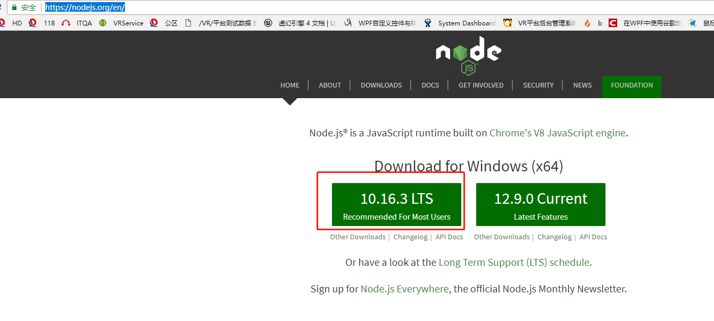

# Tag相关

文档版本: 1.0

代码版本：2019-1-25 git \[7dc776f\]

最后更新日期：2019-8-21

## 一、Tag应用场景

1. 用于数据的保存与载入 主要应用于函数 UGameplayStatics::GetAllActorsWithTag
2. 用于软装模型的相关操作：
   1. 选中模型 SelectedActor-&gt;ActorHasTag\("DecoType:Soft"\)
   2. 收藏模型，根据模型Tags包含的 Guid:xxxx ，用于个人收藏
3.  用于2D视角隐藏屋顶和天空球

## 二、VRDesign主要应用到的Tag

注：仅列出VRDesign保存载入和部分操作相关Tag

### 软装模型：

1. DecoType:Soft
2. EntityType:Furniture
3. Guid:xxxx \(具体的guid）
4. ResType: BP/Model \(具体是BP还是Model 取决于模型是是否是蓝图模型）

### 硬装部分：

1.  DecoType:Hard
2.  EntityType:Floor/Ceiling/Wall \(带Ceiling的Actor会在2D视图下隐藏\)
3. 天空球
4. EntityType:Sky\(会在2D视图下隐藏天空球）

## 三、一键应用样板房使用的Tags

### 1.运行时逻辑，房间所属判断：

1. RoomType:LivingDiningRoom/LivingRoom/LivingDiningRoomKitchen/MasterBedroom/SecondBedroom/SecondBedroomTwo/SecondBedroomThree/SecondBedroomFour/SecondBedroomFive/Bathroom/MainBathroom/GuestBathroom/GuestBathroomTwo/GuestBathroomThree/GuestBathroomFour/CommonBathroom/ToiletDryArea/ToiletWetArea/Balcony/BalconyTwo/BalconyThree/BalconyFour/LivingBalcony/DinnerRoom/Kitchen/Library/EldersRoom/KidsRoom/MultiFunction/Porch/Corridor/hallway/StairWell/Basement/Parvis/Courtyard/AudiovisualRoom/OutRoom/DeviceStage/Elevator/StorageRoom/Cloakroom/EnteringHouseholdGarden/NannyRoom/ChangingRoom/Untitled

### 2.记录房间轮廓信息：

```java
RoomInfo:
{
    "size":"",
    "roomtype":"",
    "typepath":"",
    "q3dtype":"",
    "attatchwallflag":""
}
```

### 3.实例化模型使用：

AssetPath:模型的Reference

### 4.标记云设计模型类型：

Q3DType:Door/Window/Null

## 四、其他Tags

1. 一些自己使用Tags:
2. ResType:Triangle\(用于设计师模板插件隐藏显示功能\)



