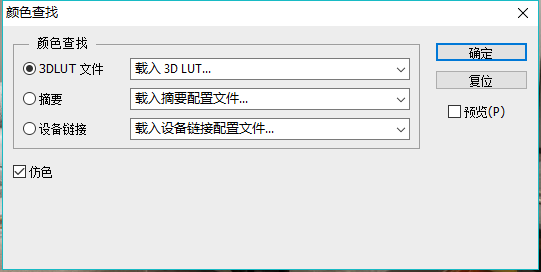

# 画面效果LUT素材制作流程

目前VRDesign中的画面效果（HDR，宝丽来等）通过后期（PostProcessVolume）完成

## LUT制作流程（参考）

### 1.截取一张VRDesign效果图在PhotoShop中打开

### 2.在PhotoShop中选择合适的LUT

#### 1.在PhotoShop工具栏选择 图像-调整-颜色查找

#### 2.选择载入3D LUT

### 3.制作UE4使用的LUT纹理

#### 1.在PS中打开RGBTable16x1.jpg



#### 2.应用LUT到RGBTable16x1

上图为了**突出对比效果**，应用了不同的LUT，在制作时请保持一致

#### 3.保存应用LUT后的纹理

#### 4.在UE4中导入LUT

#### 5.设置Texture参数

