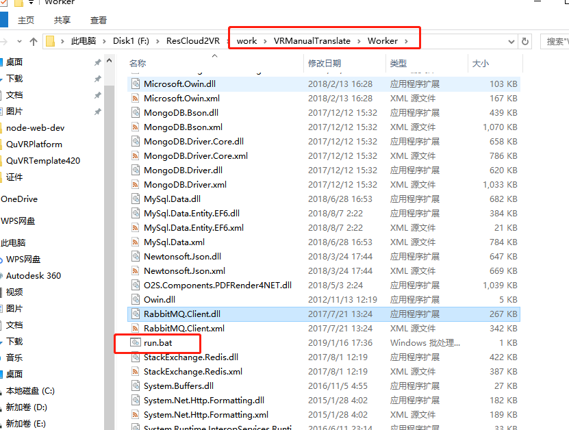

# 一键VR自动转换部署

一:从svn下载或者更新模板

[https://222.92.194.203/svn/JtlVR/Projects/QuVRTemplatePublish](https://222.92.194.203/svn/JtlVR/Projects/QuVRTemplatePublish)

二:修改一键VR转换服务名称

 修改完的转换服务名称在后台监控网页就可以显示出来,如下图

三:打开一键转换开关

1:勾选Click2VROption

2:点击AssetConverter

四:设置正式环境配置

将APICollections.json里的Strategy设置为1即为设置正式环境转换,

设置为0即为设置dev环境转换

